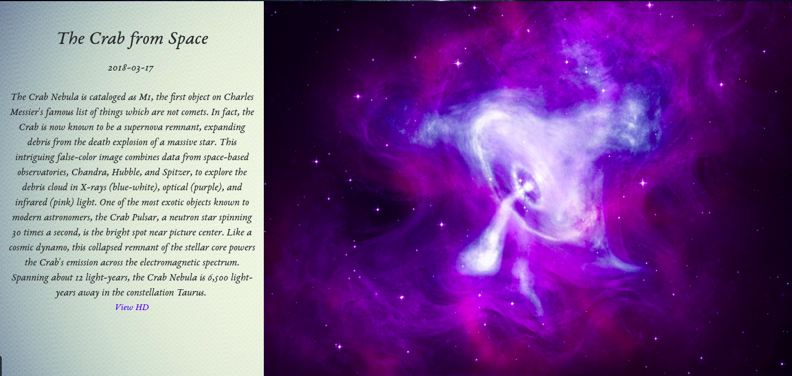

# Apod

An Angular web application that showcases the astronomical picture(or occasionally video) of the day using the [Nasa Apod](https://api.nasa.gov/api.html#apod) API.

The image/Video is accompanied by a title and description of the image.

## How It works


The app fetches the Picture of the Day and it's details from Nasa through JSON which is then rendered to the page.

An example JSON response contains the details below.

```
{
  "copyright": "Jeff Dai", 
  "date": "2017-12-22", 
  "explanation": "From dark skies above Heilongjiang province in northeastern China, meteors rain down on a wintry landscape in this beautiful composited night scene. The 48 meteors are part of last week's annual Geminid meteor shower. Despite temperatures of -28 degrees C, all were recorded in camera exposures made during the peak hour of the celestial spectacle. They stream away from the shower's radiant high above the horizon near the two bright stars of the zodiacal constellation of the Twins. A very active shower, this year the December 13-14 peak of the Geminids arrived just before the December 16 closest approach of asteroid 3200 Phaethon to planet Earth. Mysterious 3200 Phaethon is the Geminid shower's likely parent body.", 
  "hdurl": "https://apod.nasa.gov/apod/image/1712/GeminidMeteorShowerOverChina-Dai1500.jpg", 
  "media_type": "image", 
  "service_version": "v1", 
  "title": "Gemini's Meteors", 
  "url": "https://apod.nasa.gov/apod/image/1712/GeminidMeteorShowerOverChina-Dai1024.jpg"
}

```
The response renders the details to the page as shown below.



## Make it your own

These instructions will get you a copy of the project up and running on your local machine for development and testing purposes.

### Prerequisites

Ensure you have the following installed in your machine.

* Angular Cli - Installation notes and guides can be found [Here](https://cli.angular.io/)

* Node Js - Installation notes and guides can be found [Here](https://nodejs.org/en/)

### Installing

* Clone/Download this repository.

* Navigate to the directory e.g.```cd/Downloads/Apod```

* Run ```npm install``` to install modules.


* Run ```ng serve``` to start the app and navigate to [https://localhost:4200]()

## Technologies Used

* [Angular Js](https://angular.io/)
* [NASA APOD api](https://github.com/nasa/apod-api) - Provides image data daily.
* [Bootstrap](https://getbootstrap.com/)
